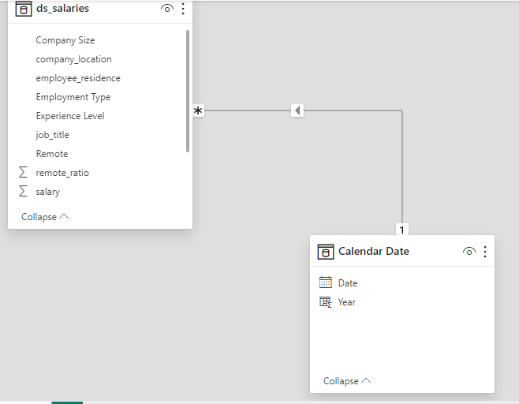
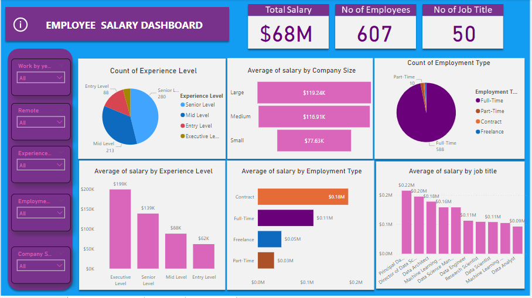
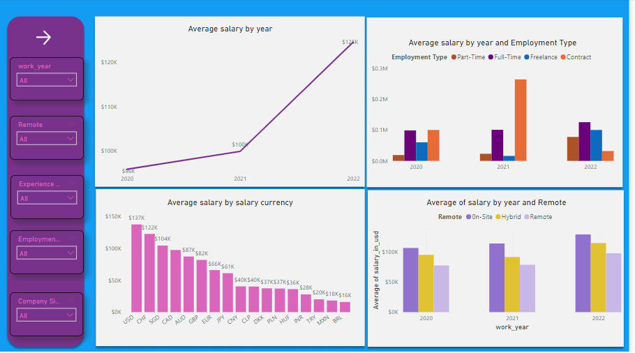
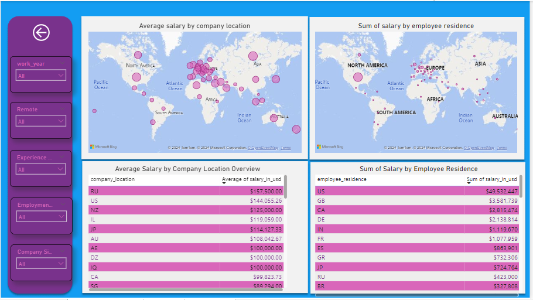

# EMPLOYEE SALARY ANALYSIS


--------

## Introduction
This is a power BI project on **Employee salary analysis**. This dataset provides valuable insights into the compensation and job roles of employees across various industries and regions. Whether you're an HR analyst, data scientist, or someone interested in understanding salary trends, this dataset offers a wealth of information to explore and analyze.

## Content
### The dataset contains the following fields:
- work_year: The year of employment.
- experience_level: The experience level of the employee (e.g., entry-level, mid-level, senior).
- employment_type: The type of employment (e.g., full-time, part-time, contract).
- job_title: The job title or position of the employee within the company.
- salary: The salary amount in the local currency.
- salary_currency: The currency in which the salary is denoted.
- salary_in_usd: The equivalent salary amount in USD (United States Dollars).
- employee_residence: The location of the employee's residence.
- remote_ratio: The percentage of remote work allowed for the position.
- company_location: The location of the company.
- company_size: The size of the company (e.g., small, medium, large).

## Problem statement
1.	What are the salary trends across different job titles and experience levels?
2.	What is the impact of remote work on compensation?
3.	What are salary levels between full-time and part-time employment?
4.	Which company location has the highest sum and average salary?
5.	Is there any correlation between company size and employee salaries?
6.	Which company size has the highest pay?

## Skills/concepts demonstrated:
### The following Power BI features were incorporated.
- DAX
- Page navigation
- Modelling
- slicers
- button.

## Modelling
There is only one table with a calendar table I created using Dax measures Calendar Auto(). 



The model is a star schema.
The two tables are joined together with a one-to-many relationship. One table which is the fact table and the other table the date table.

## Visualization
### This report comprises 3 pages:
1. Main Dashboard
2. Trends
3. Location

You can interact with the report [here](https://app.powerbi.com/view?r=eyJrIjoiNzgyOTM3M2YtMzZmYy00MWViLWI5MTQtYWE1ZDU4NjJmMzgxIiwidCI6ImNmNWM0NWEwLTcyOGItNDE1OC05NTY5LWQyZjNjYWI2NDJjNyJ9)

## Features

The information button is to display the trend. 
Slicers: To filter data base on what I want to visualize. If I want to visualize count of experience level by the work year for 2020. I can basically use my slicer to do that.
The right arrow button is to go to the last page.
The back arrow button is to go to the first page.

## Analysis

### Main Dashboard


Senior Level had the highest Count of Experience Level at 280, followed by Mid Level, Entry Level, and Executive Level.
Senior Level accounted for 46.13% of Count of Experience Level.
At 199,392.04, Executive Level had the highest Average of salary_in_usd and was 223.46% higher than Entry Level, which had the lowest Average of salary at 61,643.32.
Across all 4 Experience Level, Average of salary ranged from 61,643.32 to 199,392.04.

### Trends


At 124,522.01, 2022 had the highest Average of salary and was 29.96% higher than 2020, which had the lowest Average of salary at 95,813.00.
2022 had the highest Average of salary at 124,522.01, followed by 2021 at 99,853.79 and 2020 at 95,813.00.
2020 had 95,813.00 Average of salary, 2021 had 99,853.79, and 2022 had 124,522.01.
2021 in Employment Type Contract made up 25.97% of Average of salary.

### Location 


Average of salary was highest for RU at 157,500.00, followed by US and NZ.
Across all 50 company_location, Average of salary ranged from 4,000.00 to 157,500.00.
US accounted for 72.67% of Sum of salary.


## Insight and Recommendation

### Insights:
1. **Company Size Affects Pay**: Bigger companies tend to pay more than smaller ones. It's worth looking into why and if it's fair to everyone.

2. **Different Types of Work Get Different Pay**: Full-time workers get paid more than part-time or contract workers. Think about what benefits each type of worker gets to keep everyone happy and motivated. 😄

3. **Pay Changes Over Time**: Despite ups and downs, salaries generally went up from 2020 to 2022.📈

4. **Where You Work Matters**: Pay can vary based on where the company is and where the employees live. 🏚️


### Recommendation
- **Focus on Senior Staff**: Because there are a lot of senior-level employees, it's smart to support them with training and growth opportunities to keep their skills and leadership valuable.

- **Fix Pay Differences by Job Title**: Even though Principal Data Scientists earn the most, there's a big gap between what executives and entry-level workers make. Look into adjusting pay to make sure it's fair and attracts and keeps good workers at all levels.




                                                                    ```## *THANK YOU* 🤝``` 

